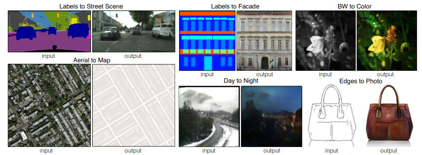
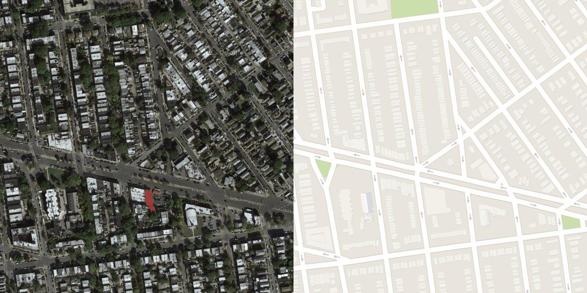
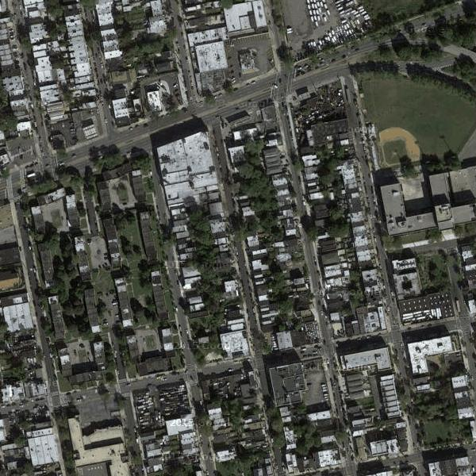
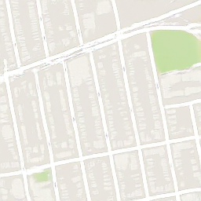
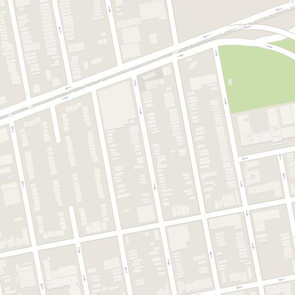
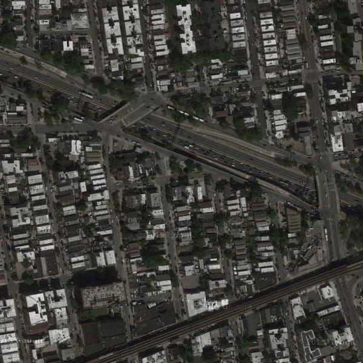
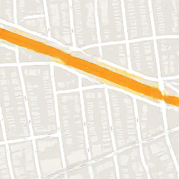
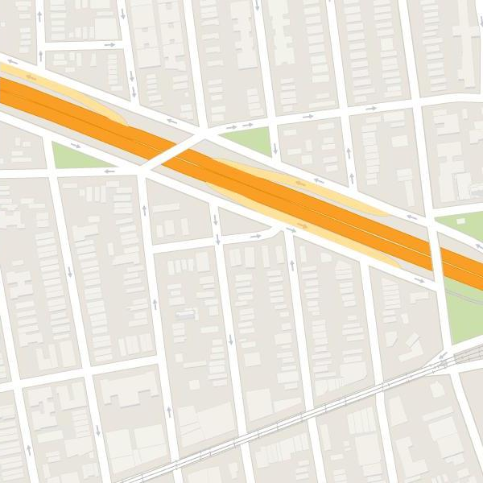

# PIX2PIX-pytorch
This repo is a pytorch implementation of 
[Image-to-Image Translation with Conditional Adversarial Networks (PIX2PIX)](https://arxiv.org/abs/1611.07004) on [Maps dataset](https://www.kaggle.com/datasets/vikramtiwari/pix2pix-dataset)



GANs, also known as Generative Adversarial Networks, are one of the most fascinating new developments in deep learning.
Yann LeCun saw GANs as "the most fascinating idea in the last 10 years in ML" when Ian Goodfellow and Yoshua Bengio from the University of Montreal first unveiled them in 2014.
GANS are frequently used to make deep fake films, improve the quality of images, face swap, design gaming characters, and much more. 

The Pix2Pix GAN is a general approach for image-to-image translation. It is based on the conditional generative adversarial network, where a target image is generated, conditional on a given input image. In this case, the Pix2Pix GAN changes the loss function so that the generated image is both plausible in the content of the target domain, and is a plausible translation of the input image.

# Setup and Generate
This code is developed under following library dependencies
```commandline
python 3.8
torch 1.12.0
torchvision 0.13.0
```
Start with creating a virtual environment then open your terminal and follow the following steps:
```commandline
git clone "https://github.com/zaghlol94/PIX2PIX-pytorch"
cd PIX2PIX-pytorch
pip install -r requirements.txt
bash download_assets.sh
cd src
python generate.py "input image path"  ex: python generate.py "results/test_1.png"
```
# Dataset and Train
## Dataset
This is the dataset for pix2pix model which aims to work as a general-purpose solution for image-to-image translation problems.
The data folder contains two folders: ```train``` and ```val``` every folder contains around 1000 image every image combined the input and the target in the same 1200 x 1200 image, the ```src/dataset``` script process the images to have input/target images 600 x 600.
download from [here](https://www.kaggle.com/datasets/vikramtiwari/pix2pix-dataset)


```commandline
.
└── data
    ├── train
    │   ├── 1.jpg
    │   ├── 2.jpg
    │   ├── 3.jpg
    │   ├── .
    │   ├── .
    │   ├── .
    │   └── 1069.jpg
    └── val
        ├── 1.jpg
        ├── 2.jpg
        ├── 3.jpg
        ├── .
        ├── .
        ├── .
        └── 1069.jpg
```
## Training
Download Maps dataset and add the images' folder in ```src/data```
if you rename the root folder of the dataset don't forget to change the ````TRAIN_DIR```` and ```VAL_DIR```
variable in [config.py](https://github.com/zaghlol94/PIX2PIX-pytorch/blob/main/src/config.py)
```commandline
cd src
python train.py
```
# Results
the first image represents the input, while the second represents the results from the algorithm and the third image is the target 
<p float="left">
  
   
  
</p>

<p float="left">
  
   
  
</p>

# Citation
```commandline
@misc{https://doi.org/10.48550/arxiv.1611.07004,
  doi = {10.48550/ARXIV.1611.07004},
  
  url = {https://arxiv.org/abs/1611.07004},
  
  author = {Isola, Phillip and Zhu, Jun-Yan and Zhou, Tinghui and Efros, Alexei A.},
  
  keywords = {Computer Vision and Pattern Recognition (cs.CV), FOS: Computer and information sciences, FOS: Computer and information sciences},
  
  title = {Image-to-Image Translation with Conditional Adversarial Networks},
  
  publisher = {arXiv},
  
  year = {2016},
  
  copyright = {arXiv.org perpetual, non-exclusive license}
}
```